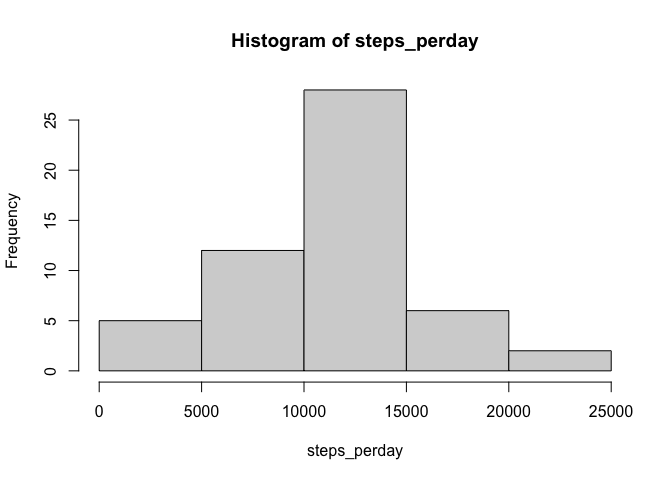
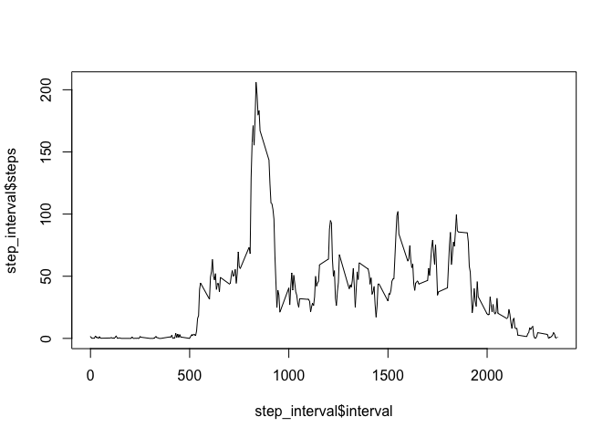
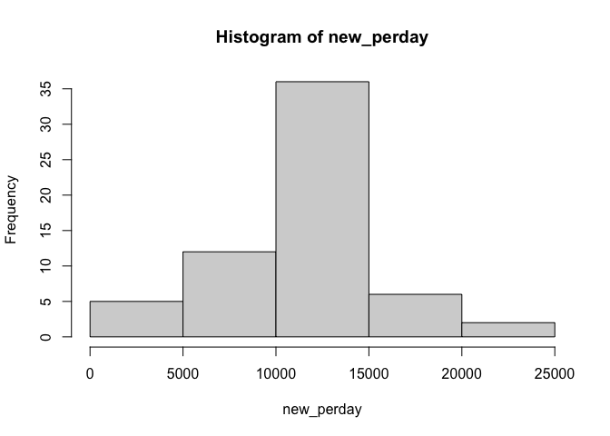
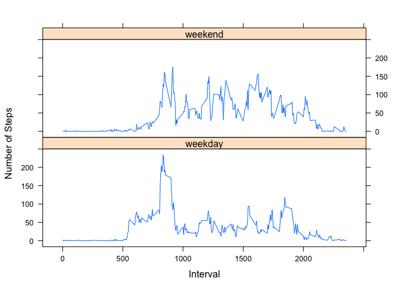

## Loading and preprocessing the data

```r
activity<-read.csv("activity.csv")
```

## What is mean total number of steps taken per day?

Make a histogram of the total number of steps taken each day

```r
steps_perday <- tapply(activity$steps,activity$date,sum)
hist(steps_perday)
```

<!-- -->

Calculate and report the mean and median of the total number of steps taken per day

```r
mean(steps_perday, na.rm = TRUE)
```

```
## [1] 10766.19
```

```r
median(steps_perday, na.rm = TRUE)
```

```
## [1] 10765
```

## What is the average daily activity pattern?

Make a time series plot of the 5-minute interval and the average number of steps taken, averaged across all days

```r
step_interval <- aggregate(steps~interval,data = activity, FUN = mean, na.rm=TRUE)
plot(step_interval$interval,step_interval$steps, type = "l")
```

<!-- -->

Which 5-minute interval, on average across all the days in the dataset, contains the maximum number of steps?

```r
step_interval$interval[which.max(step_interval$steps)]
```

```
## [1] 835
```

## Imputing missing values

Calculate and report the total number of missing values in the dataset

```r
nrow(activity[is.na(activity$steps),])
```

```
## [1] 2304
```

Devise a strategy for filling in all of the missing values in the dataset.
My strategy is to use the mean for that 5-minute interval.

```r
newdata <- activity
imputing <- function(x,y){
  if(is.na(x))
      newvalue <- step_interval$steps[which(step_interval$interval == y)]
  else
      newvalue <- x
  return(newvalue)
}
newdata$steps <- mapply(imputing, newdata$steps, newdata$interval)
summary(newdata)
```

```
##      steps            date              interval     
##  Min.   :  0.00   Length:17568       Min.   :   0.0  
##  1st Qu.:  0.00   Class :character   1st Qu.: 588.8  
##  Median :  0.00   Mode  :character   Median :1177.5  
##  Mean   : 37.38                      Mean   :1177.5  
##  3rd Qu.: 27.00                      3rd Qu.:1766.2  
##  Max.   :806.00                      Max.   :2355.0
```

Make a histogram of the total number of steps taken each day and Calculate and report the mean and median total number of steps taken per day. 

```r
new_perday <- tapply(newdata$steps,newdata$date,sum)
hist(new_perday)
```

<!-- -->

```r
mean(new_perday, na.rm = TRUE)
```

```
## [1] 10766.19
```

```r
median(new_perday, na.rm = TRUE)
```

```
## [1] 10766.19
```

Do these values differ from the estimates from the first part of the assignment? What is the impact of imputing missing data on the estimates of the total daily number of steps?

They are just a slightly different.

## Are there differences in activity patterns between weekdays and weekends?

Create a new factor variable in the dataset with two levels – “weekday” and “weekend” indicating whether a given date is a weekday or weekend day.

```r
activity$date<-as.Date(activity$date)
isweekday <- function(x){
   if (weekdays(x) %in% c("Sunday", "Saturday"))
       return("weekend")
   else
       return("weekday")
}
activity$category <- mapply(isweekday, activity$date)
step_interval <- aggregate(steps~interval + category,data = activity, FUN = mean, na.rm=TRUE)
```

Make a panel plot containing a time series plot of the 5-minute interval and the average number of steps taken, averaged across all weekday days or weekend days.

```r
library(lattice)
xyplot(steps ~ interval|category, data = step_interval, type="l",  layout = c(1,2),
       ylab="Number of Steps", xlab="Interval")
```

<!-- -->
